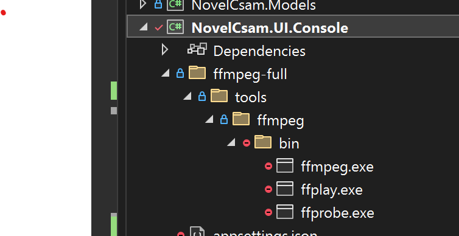

# Novel CSAM Detection# ContentSafteyDemo


[](https://opensource.org/licenses/MIT)## Azure AI Content Safety

[](https://dotnet.microsoft.com/en-us/download/dotnet/8.0)

- [https://learn.microsoft.com/en-us/azure/ai-services/content-safety/overview]()

A comprehensive Microsoft Azure accelerator for detecting novel Child Sexual Abuse Material (CSAM) using AI-powered content safety analysis. This application extracts frames from video files, performs safety analysis, and exports detailed results.- [https://learn.microsoft.com/en-us/azure/ai-services/content-safety/concepts/harm-categories?tabs=warning]()


**Table of Contents**## Overview

- [Overview](#overview)

- [Features](#features)`NovelCsam.UI.Console` is a console application that provides functionality for extracting frames from video files, uploading them to Azure Blob Storage, and running safety analysis on the extracted frames.

- [Prerequisites](#prerequisites)

- [Getting Started](#getting-started)## Features

- [Architecture](#architecture)

- [Configuration](#configuration)- Extract frames from video files.

- [Usage](#usage)- Upload extracted frames to Azure Blob Storage.

- [API Reference](#api-reference)- Run safety analysis on the extracted frames.

- [Troubleshooting](#troubleshooting)- Supports multiple image formats.

- [Contributing](#contributing)- Export results.

- [Code of Conduct](#code-of-conduct)

- [License](#license)## Prerequisites


## Overview- .NET 8 SDK

  - [Download .NET 8 SDK](https://dotnet.microsoft.com/en-us/download/dotnet/8.0).

The Novel CSAM Detection accelerator provides automated detection and classification of potentially harmful content in video files. It leverages:- Azure Storage Account

- Azure Content Safety Service

- **Azure Blob Storage** for scalable file management  - [https://learn.microsoft.com/en-us/azure/ai-services/content-safety/overview]()

- **Azure Content Safety API** for real-time content analysis- FFMpeg

- **Azure SQL Database** for results persistence  - The `ffmpeg.exe, ffplay.exe, and ffprobe.exe` files must be placed in the `NovelCsam.UI.Console` project directory, as shown in the picture. You can download the executable for various platforms, including Windows, from the link above.

- **Azure OpenAI Service** for enhanced summarization and analysis  - [Download FFmpeg](https://ffmpeg.org/download.html)

- **Azure Durable Functions** for orchestrated processing workflows  - 


### Supported Azure Regions and Services## Getting Started


This application is designed for use with:### Clone the Repository

- Azure Blob Storage (Data Lake Storage Gen2)

- Azure Content Safety Service```sh

- Azure SQL Databasegit clone https://github.com/yourusername/NovelCsamDetection.git

- Azure OpenAI Servicecd NovelCsamDetection/NovelCsam.UI.Console

- Azure Application Insights```

- Azure Cosmos DB (optional, for alternate storage)

## Application Configuration

### Related Resources

The application requires configuration for Azure Storage, Content Safety services, Azure SQL Database, Azure Cosmos DB, OpenAI Service, and Application Insights. Update the `appsettings.json` file with your Azure credentials and settings.

- [Azure AI Content Safety Documentation](https://learn.microsoft.com/en-us/azure/ai-services/content-safety/overview)

- [Harm Categories Reference](https://learn.microsoft.com/en-us/azure/ai-services/content-safety/concepts/harm-categories)**If  ***InvokeOpenAI* **is set to True, then please populate:**

- [Azure Durable Functions](https://learn.microsoft.com/en-us/azure/azure-functions/durable/)

* **"OpenAiDeploymentName",**

## Features* **"OpenAiKey",**

* **"OpenAiEndpoint",**

- ✅ **Video Frame Extraction** - Automatically extract frames from multiple video formats* **"OpenAiModel"**

- ✅ **Batch Image Upload** - Upload multiple images for analysis

- ✅ **Content Safety Analysis** - Real-time analysis using Azure Content Safety API```

- ✅ **Multi-Category Detection** - Detect hate, violence, self-harm, and sexual content{

- ✅ **AI-Powered Summaries** - Optional frame summarization using Azure OpenAI  "Azure": {

- ✅ **Child Presence Detection** - Identify frames containing minors    "SqlConnectionString": "",

- ✅ **Scalable Processing** - Durable Functions for long-running operations    "ContentSafety": {

- ✅ **CSV Export** - Export analysis results for further processing      "ContentSafetyConnectionString1": "",

- ✅ **High-Quality Image Processing** - Automatic resizing with quality preservation      "ContentSafetyConnectionKey1": "",

- ✅ **Connection Pooling** - Support for multiple Content Safety instances for rate limit handling      "ContentSafetyConnectionString2": "",

      "ContentSafetyConnectionKey2": "",

### Supported Video Formats      "ContentSafetyConnectionString3": "",

      "ContentSafetyConnectionKey3": ""

MP4, AVI, MOV, WMV, FLV, MKV, WebM, MPEG, MPG    },

    "StorageAccountName": "",

### Supported Image Formats    "StorageAccountKey": "",

    "StorageAccountUrl": "",

JPG, JPEG, PNG, BMP, GIF, TIFF    "OpenAiDeploymentName": "",

    "OpenAiKey": "",

## Prerequisites    "OpenAiEndpoint": "",

    "OpenAiModel": "",

### System Requirements    "AppInsightsConnectionString": "",

    "AnalyzeFrameAzureFunctionUrl": "",

- **Operating System**: Windows 10/11 or later    "InvokeOpenAI": "",

- **.NET SDK**: [.NET 8 SDK](https://dotnet.microsoft.com/en-us/download/dotnet/8.0)    "DebugToConsole": "",

- **FFmpeg**: Required for video processing    "AzureCloudDesignation": ""

  - Download from: https://ffmpeg.org/download.html  }

  - Windows binaries: `ffmpeg.exe`, `ffplay.exe`, `ffprobe.exe`}

  - **Installation**: Place executables in `NovelCsam.UI.Console` project directory```


### Azure Services### Configuration Placeholders


You'll need the following Azure resources:* **Azure SQL Connection String** : `"SqlConnectionString"`

* **Content Safety Connection String** : `"ContentSafetyConnectionString"`

1. **Azure Storage Account** (with Data Lake Storage Gen2 enabled)* **Content Safety Connection Key** : `"ContentSafetyConnectionKey"`

2. **Azure Content Safety Service** (3 instances recommended for rate limit handling)* **Storage Account Name** : `"StorageAccountName"`

3. **Azure SQL Database** with appropriate schema* **Storage Account Key** : `"StorageAccountKey"`

4. **Azure OpenAI Service** (optional, for summarization features)* **Storage Account URL** : `"StorageAccountUrl"`

5. **Azure Application Insights** (for telemetry and logging)* **OpenAI Deployment Name** : `"OpenAiDeploymentName"`

6. **Azure Durable Functions** (optional, for orchestrated workflows)* **OpenAI Key** : `"OpenAiKey"`

* **OpenAI Endpoint** : `"OpenAiEndpoint"`

### Azure Credentials* **OpenAI Model** : `"OpenAiModel"`

* **App Insights Connection String** : `"AppInsightsConnectionString"`

Ensure you have access to:* **Invoke Open AI**: `"InvokeOpenAI"`

- Storage account name and key* **Debug to Console**: `"DebugToConsole"`

- Content Safety service endpoints and keys

- SQL Database connection string## Configuration Definitions

- OpenAI deployment credentials (if using AI features)

* **SqlConnectionString** :

## Getting Started  * **Purpose** : Provides the connection string for connecting to an Azure SQL Database. This string includes the server address, database name, user credentials, and other connection settings.

* **`ContentSafetyConnectionString`** :

### 1. Clone the Repository  * **Purpose** : Specifies the connection string for the Azure Content Safety service, which is used to access the content safety API.

* **`ContentSafetyConnectionKey`** :

```bash  * **Purpose** : Contains the API key for authenticating with the Azure Content Safety service. This key is required to authorize requests to the content safety API.

git clone https://github.com/microsoft/Novel-CSAM-Detection.git* **`StorageAccountName`** :

cd Novel-CSAM-Detection  * **Purpose** : Specifies the name of the Azure Storage account. This name is used to identify the storage account within Azure.

```* **`StorageAccountUrl`** :

  * **Purpose** : Specifies the URL for accessing the Azure Storage account. This URL is used to interact with the storage services provided by the account.

### 2. Install FFmpeg* **`StorageAccountKey`** :

  * **Purpose** : Provides the access key for the Azure Storage account. This key is used to authenticate and authorize access to the storage account.

#### Windows* **`OpenAiDeploymentName`** :

  * **Purpose** : Indicates the deployment name for the OpenAI service. This name is used to identify the specific deployment of the OpenAI model.

1. Download FFmpeg from https://ffmpeg.org/download.html* **`OpenAiKey`** :

2. Extract the files  * **Purpose** : Contains the API key for authenticating with the OpenAI service. This key is required to authorize requests to the OpenAI API.

3. Copy `ffmpeg.exe`, `ffplay.exe`, and `ffprobe.exe` to:* **`OpenAiEndpoint`** :

   ```  * **Purpose** : Specifies the endpoint URL for accessing the OpenAI service. This URL is used to send requests to the OpenAI API.

   NovelCsam.UI.Console/* **`OpenAiModel`** :

   ```  * **Purpose** : Indicates the model name for the OpenAI service. This name is used to specify which OpenAI model to use for processing requests.

* **`AppInsightsConnectionString`** :

**Note**: The application looks for these files in the `NovelCsam.UI.Console` directory at runtime.  * **Purpose** : Provides the connection string for Azure Application Insights. This string is used to configure telemetry data collection and monitoring.

* **`AnalyzeFrameAzureFunctionUrl`** :

### 3. Set Up Azure Resources  * **Purpose** : Specifies the URL for the Azure Function that analyzes frames. This URL is used to trigger the function and pass data for analysis.

* **`InvokeOpenAI`** :

Use the provided Infrastructure scripts to create necessary Azure resources:  * **Purpose** : A flag indicating whether to invoke the OpenAI service. This flag is used to enable or disable calls to the OpenAI API.

    * True or False value.

```powershell* **`DebugToConsole`:**

# Set up app settings for Azure Functions  * **Purpose** : A flag indicating whether to output debug information to the console. This flag is used to enable or disable console logging for debugging purposes.

./Infrastructure/Azure\ Functions/Set-AppSettings.ps1    * True or False value.


# Create database tables (requires SQL connectivity)## Code Structure

sqlcmd -S <server> -U <user> -P <password> -i Infrastructure/Database/Create_Tables.sql

```* `Program.cs`: The main entry point of the application.

* `IVideoHelper.cs`: Interface for video-related operations.

### 4. Configure Application Settings* `IStorageHelper.cs`: Interface for storage-related operations.

* `VideoHelper.cs`: Implementation of video-related operations.

Copy and configure `appsettings.json`:* `StorageHelper.cs`: Implementation of storage-related operations.


```bash## Database

cp NovelCsam.UI.Console/appsettings.example.json NovelCsam.UI.Console/appsettings.json

```This application uses a SQL database.

The database table create scripts can be found under

### 5. Build and Runthe "Infrastructure" folder. This code can also be

changed to use any database that we choose. There is

```bashcode that writes result data to a Cosmos DB for example under NovelCsam.Helpers/CosmosDBHelper.cs.

# Restore dependencies

dotnet restore* **Create_Tables.sql :** Database tables


# Build the solution## Contributing

dotnet build

Contributions are welcome! Please open an issue or submit a pull request for any improvements or bug fixes.

# Run the console application

cd NovelCsam.UI.Console## License

dotnet run

```This project is licensed under the MIT License. See the LICENSE file for details.


## Architecture## Contact


### Project StructureFor any questions or support, please contact [c](vscode-file://vscode-app/c:/Users/cwoodland/AppData/Local/Programs/Microsoft%20VS%20Code/resources/app/out/vs/code/electron-sandbox/workbench/workbench.html)woodland@microsoft.com.


```
NovelCsamDetection/
├── NovelCsam.Models/                # Shared data models
│   ├── FrameResult.cs              # Analysis result model
│   ├── AnalyzeFrameModel.cs        # Frame analysis data
│   └── Orchestration/              # Durable Functions models
├── NovelCsam.Helpers/              # Reusable helper classes
│   ├── VideoHelper.cs              # Video processing operations
│   ├── StorageHelper.cs            # Azure Storage operations
│   ├── AzureSQLHelper.cs           # Database operations
│   ├── ContentSafetyHelper.cs       # Content Safety API integration
│   ├── FFmpegHelper.cs             # FFmpeg wrapper utilities
│   ├── ImageResizeHelper.cs        # Image optimization
│   ├── CsvExporter.cs              # CSV export functionality
│   ├── LogHelper.cs                # Logging utilities
│   └── Interfaces/                 # Service interfaces
├── NovelCsam.Functions/            # Azure Functions
│   ├── AnalyzeFrame.cs            # Frame analysis trigger
│   ├── ImageProcessingOrchestrator.cs  # Durable Function orchestrator
│   └── ListBlobs.cs               # Blob enumeration function
├── NovelCsam.UI.Console/          # Main console application
│   ├── Program.cs                 # Application entry point
│   ├── MenuHandler.cs             # Menu and user interaction
│   └── appsettings.json           # Configuration file
├── NovelCsamDetection.Tests/      # Unit and integration tests
└── Infrastructure/
    ├── Azure\ Functions/           # Function deployment scripts
    └── Database/                   # SQL schema scripts
```

### Data Flow

```
User Input
    ↓
Video/Image Upload → Azure Blob Storage
    ↓
Frame Extraction (FFmpeg)
    ↓
Content Analysis (Safety API) → Azure SQL Database
    ↓
AI Summarization (Optional, OpenAI)
    ↓
Child Detection (Optional, OpenAI)
    ↓
Export to CSV
```

### Processing Modes

1. **Direct Processing**: Synchronous analysis of frames
2. **Durable Function Orchestration**: Asynchronous, long-running batch processing

## Configuration

### Application Settings Structure

```json
{
  "Azure": {
    "SqlConnectionString": "",
    "ContentSafety": {
      "ContentSafetyConnectionString1": "",
      "ContentSafetyConnectionKey1": "",
      "ContentSafetyConnectionString2": "",
      "ContentSafetyConnectionKey2": "",
      "ContentSafetyConnectionString3": "",
      "ContentSafetyConnectionKey3": ""
    },
    "StorageAccountName": "",
    "StorageAccountKey": "",
    "StorageAccountUrl": "",
    "OpenAiDeploymentName": "",
    "OpenAiKey": "",
    "OpenAiEndpoint": "",
    "OpenAiModel": "",
    "AppInsightsConnectionString": "",
    "AnalyzeFrameAzureFunctionUrl": "",
    "InvokeOpenAI": "true|false",
    "DebugToConsole": "true|false",
    "AzureCloudDesignation": "Public|Government|China"
  }
}
```

### Configuration Parameters

#### Required Settings

| Parameter | Description | Example |
|-----------|-------------|---------|
| `SqlConnectionString` | Azure SQL Database connection string | `Server=tcp:server.database.windows.net,1433;...` |
| `StorageAccountName` | Azure Storage account name | `mystorageaccount` |
| `StorageAccountKey` | Storage account access key | (64-character key) |
| `StorageAccountUrl` | Storage account URL | `https://mystorageaccount.dfs.core.windows.net` |

#### Content Safety Configuration

Multiple Content Safety instances can be configured for rate limit management:

```json
"ContentSafety": {
  "ContentSafetyConnectionString1": "https://resource1.cognitiveservices.azure.com/",
  "ContentSafetyConnectionKey1": "key1",
  "ContentSafetyConnectionString2": "https://resource2.cognitiveservices.azure.com/",
  "ContentSafetyConnectionKey2": "key2",
  "ContentSafetyConnectionString3": "https://resource3.cognitiveservices.azure.com/",
  "ContentSafetyConnectionKey3": "key3"
}
```

#### Optional OpenAI Settings

Required only if `InvokeOpenAI` is set to `true`:

| Parameter | Description |
|-----------|-------------|
| `OpenAiDeploymentName` | Your OpenAI deployment name |
| `OpenAiKey` | OpenAI API key |
| `OpenAiEndpoint` | OpenAI service endpoint |
| `OpenAiModel` | Model name (e.g., `gpt-4-vision`) |

#### Optional Settings

| Parameter | Description | Default |
|-----------|-------------|---------|
| `AppInsightsConnectionString` | Application Insights connection string | Empty |
| `AnalyzeFrameAzureFunctionUrl` | URL to Azure Function for frame analysis | Empty |
| `InvokeOpenAI` | Enable OpenAI features | `false` |
| `DebugToConsole` | Log debug info to console | `false` |
| `AzureCloudDesignation` | Azure cloud environment | `Public` |

## Usage

### Starting the Application

```bash
cd NovelCsam.UI.Console
dotnet run
```

### Menu Options

The console application provides the following menu:

```
Novel CSAM Detection Menu
#######################################################
#####..1.) Upload Video to Azure..................#####
#####..2.) Upload Images to Azure.................#####
#####..3.) Extract Frames.........................#####
#####..4.) Run Safety Analysis....................#####
#####..5.) Export Run.............................#####
#####..6.) Run Safety Analysis (Durable Function) #####
#####..X.) Exit...................................#####
#######################################################
```

### Option 1: Upload Video

1. Select option `1`
2. Browse to select a video file
3. Video will be uploaded to Azure Blob Storage
4. System displays upload path and status

**Use Case**: Prepare video files for frame extraction

### Option 2: Upload Images

1. Select option `2`
2. Browse to select a folder containing images
3. Enter a custom folder name for organization
4. Images are automatically organized into groups of 100
5. Timestamp-based directory structure is created

**Use Case**: Batch upload pre-extracted images for analysis

### Option 3: Extract Frames

1. Select option `3`
2. Choose a video from the input container
3. System extracts frames at specified interval
4. Frames are saved to blob storage in extracted container
5. Progress bar shows extraction status

**Use Case**: Convert video files to individual frames for analysis

### Option 4: Run Safety Analysis

1. Select option `4`
2. Choose a directory containing frames
3. Optionally enable GPT-powered summarization
4. Optionally enable child presence detection
5. System analyzes each frame and stores results
6. Displays completion status and RunId

**Configuration**:
- Summary generation: `Create a summary for each frame using GPT? (y or n)`
- Child detection: `Identify if a child is in the frame using GPT? (y or n)`

### Option 5: Export Run

1. Select option `5`
2. Choose a directory to export
3. Enter export filename (e.g., `output.csv`)
4. CSV file generated with all analysis results
5. Includes severity scores for all content categories

**Output Format**: CSV with columns for each detection category and analysis result

### Option 6: Run Safety Analysis (Durable Function)

1. Select option `6`
2. Similar to Option 4, but uses Azure Durable Functions
3. Better for long-running batch operations
4. Tracks orchestration status automatically
5. Handles retries and resilience automatically

**Advantages**:
- Scales to process thousands of frames
- Automatic retry logic
- Fault-tolerant execution
- Distributed processing

## API Reference

### VideoHelper

```csharp
/// <summary>
/// Uploads a file to Azure Blob Storage
/// </summary>
Task<string> UploadFileToBlobAsync(
    string containerName, 
    string containerFolderPath, 
    string sourceFileNameOrPath, 
    string containerFolderPostfix = "", 
    bool isImages = false, 
    string timestampIn = "", 
    string customName = "")

/// <summary>
/// Extracts frames and analyzes them
/// </summary>
Task<string> UploadFrameResultsAsync(
    string containerName,
    string containerFolderPath, 
    string containerFolderPathResults, 
    bool withBase64ofImage = false,
    bool getSummaryB = true, 
    bool getChildYesNoB = true)

/// <summary>
/// Uses Durable Functions for orchestrated analysis
/// </summary>
Task UploadFrameResultsDurableFunctionAsync(
    string containerName,
    string containerFolderPath, 
    string containerFolderPathResults, 
    bool withBase64ofImage = false,
    bool getSummaryB = true, 
    bool getChildYesNoB = true, 
    string runId = "")
```

### StorageHelper

```csharp
/// <summary>
/// Lists directories in blob storage
/// </summary>
Task<Dictionary<int, string>> ListDirectoriesInFolderAsync(
    string containerName, 
    string folderPath, 
    int maxDepth = 10)

/// <summary>
/// Lists blobs with optional resizing
/// </summary>
Task<Dictionary<string, BinaryData>> ListBlobsInFolderWithResizeAsync(
    string containerName, 
    string folderPath, 
    int maxDepth = 10, 
    bool resize = true)

/// <summary>
/// Downloads a file from blob storage
/// </summary>
Task DownloadFileAsync(
    string containerName, 
    string containerFolderPath, 
    string fileName, 
    string localVideoPath)
```

### AzureSQLHelper

```csharp
/// <summary>
/// Creates a frame analysis result record
/// </summary>
Task<IFrameResult?> CreateFrameResult(IFrameResult item)

/// <summary>
/// Retrieves frame results with severity levels
/// </summary>
Task<List<IFrameDetailResult>?> GetFrameResultWithLevelsAsync(string frameId)
```

## Logging

The application uses structured logging with the `LogHelper` class:

```csharp
// Information logging
LogHelper.LogInformation("Frame processed successfully", 
    nameof(VideoHelper), nameof(ProcessFrame));

// Warning logging
LogHelper.LogWarning("No images found in folder", 
    nameof(MenuHandler), nameof(ProcessUploadImagesAsync));

// Exception logging
LogHelper.LogException($"Processing failed: {ex.Message}", 
    nameof(VideoHelper), nameof(ProcessFrame), ex);
```

Logs are sent to:
- Console output (if `DebugToConsole` is enabled)
- Application Insights (if configured)
- Local file system (if configured)

## Troubleshooting

### Common Issues and Solutions

#### FFmpeg Not Found

**Error**: `FFmpeg executables not found in directory`

**Solution**:
1. Download FFmpeg from https://ffmpeg.org/download.html
2. Extract `ffmpeg.exe`, `ffplay.exe`, `ffprobe.exe`
3. Place files in `NovelCsam.UI.Console/` directory
4. Verify with: `where ffmpeg` (in project directory)

#### Missing Configuration

**Error**: `Missing environment variable value for key 'AZURE_SQL_CONNECTION_STRING'`

**Solution**:
1. Check `appsettings.json` exists in `NovelCsam.UI.Console/`
2. Verify all required settings are populated
3. Ensure connection strings are valid
4. Test connectivity: `Test-AzureSDK` or use Azure CLI

#### Content Safety Rate Limiting

**Error**: `429 Too Many Requests`

**Solution**:
1. Configure multiple Content Safety instances (up to 3)
2. Update `appsettings.json`:
   ```json
   "ContentSafety": {
     "ContentSafetyConnectionString1": "...",
     "ContentSafetyConnectionString2": "...",
     "ContentSafetyConnectionString3": "..."
   }
   ```
3. Application automatically distributes requests across instances

#### Timeout Issues with Large Videos

**Error**: `Operation timeout exceeded`

**Solution**:
1. Use Durable Functions (Option 6) for large files
2. Increase frame interval to reduce extraction time
3. Segment video into smaller chunks first
4. Check Azure Function timeout settings (default: 5 minutes)

#### Database Connection Errors

**Error**: `Cannot connect to SQL Database`

**Solution**:
1. Verify connection string format
2. Check firewall rules: Add your IP to Azure SQL Firewall
3. Verify credentials and permissions
4. Test with Azure Data Studio or SSMS first

#### Storage Account Access Issues

**Error**: `Authentication failed for Storage Account`

**Solution**:
1. Verify storage account name and key
2. Check blob storage URL format
3. Ensure storage account has Data Lake Gen2 enabled
4. Verify credentials haven't expired (keys rotate periodically)

#### OpenAI Integration Issues

**Error**: `OpenAI API returns 429 or 401`

**Solution**:
1. Verify `InvokeOpenAI` is set to `true`
2. Check all OpenAI settings are populated
3. Verify API key and endpoint are correct
4. Check quota and rate limits in Azure OpenAI Portal
5. Test with `curl` or Postman first

### Logging and Diagnostics

Enable detailed logging:

1. Set `DebugToConsole` to `true` in `appsettings.json`
2. Configure Application Insights connection string
3. Review logs in Azure portal under Application Insights
4. Use Azure Storage Explorer for blob inspection

### Performance Optimization

**For Large-Scale Processing**:

1. Use Durable Functions (Option 6) for batch operations
2. Configure multiple Content Safety instances
3. Optimize frame extraction interval (balance quality vs. speed)
4. Use image resizing for faster processing
5. Consider Azure Batch for massive parallel processing

**Configuration Tuning**:

```json
{
  "Azure": {
    "BatchSize": 50,              
    "FrameInterval": 5,           
    "MaxConcurrentRequests": 10,  
    "DurableTaskTimeout": 3600    
  }
}
```

## Local Settings Configuration Guide

This document provides detailed documentation for all configuration keys used in `local.settings.json` for the Novel CSAM Detection Azure Functions project.

### Quick Start

1. Copy the template below to `local.settings.json`
2. Update connection strings for your Azure services
3. Adjust settings based on your deployment requirements
4. For local development with Azurite, use `"UseDevelopmentStorage=true"` for storage settings

### Configuration Template

```json
{
  "IsEncrypted": false,
  "Values": {
    "AzureWebJobsStorage": "UseDevelopmentStorage=true",
    "FUNCTIONS_WORKER_RUNTIME": "dotnet-isolated",
    "FUNCTIONS_WORKER_RUNTIME_VERSION": "8",
    "BLOB_LISTING_MAX_DEPTH": "3",
    "RETRY_MAX_ATTEMPTS": "3",
    "RETRY_BACKOFF_MULTIPLIER": "2.0",
    "RATE_LIMIT_ERROR_CODE": "429",
    "DETAILED_ANALYSIS_PROMPT": "Can you do a detail analysis and tell me all the minute details about this image. Use no more than 450 words!!!",
    "CHILD_DETECTION_PROMPT": "Is there a younger person or child in this image? If you can't make a determination ANSWER No, ONLY ANSWER Yes or No!!",
    "ENABLE_SQL_PERSISTENCE": "true",
    "ENABLE_JSON_EXPORT": "false",
    "JSON_EXPORT_CONTAINER_NAME": "results",
    "JSON_EXPORT_FOLDER_PATH": "json-results",
    "INVOKE_OPEN_AI": "false",
    "OPEN_AI_DEPLOYMENT_NAME": "",
    "OPEN_AI_KEY": "",
    "OPEN_AI_ENDPOINT": "",
    "OPEN_AI_MODEL": "",
    "CONTENT_SAFETY_CONNECTION_STRING": "",
    "CONTENT_SAFETY_CONNECTION_KEY": "",
    "CONTENT_SAFETY_CONNECTION_STRING1": "",
    "CONTENT_SAFETY_CONNECTION_KEY1": "",
    "CONTENT_SAFETY_CONNECTION_STRING2": "",
    "CONTENT_SAFETY_CONNECTION_KEY2": "",
    "CONTENT_SAFETY_CONNECTION_STRING3": "",
    "CONTENT_SAFETY_CONNECTION_KEY3": "",
    "AZURE_SQL_CONNECTION_STRING": "",
    "AZURE_STORAGE_CONNECTION_STRING": "",
    "COSMOS_DB_CONNECTION_STRING": "",
    "KEY_VAULT_URL": ""
  }
}
```

### Configuration Keys Reference

#### Azure Functions Runtime Settings

##### `AzureWebJobsStorage`
- **Type:** Connection String
- **Default:** `UseDevelopmentStorage=true`
- **Purpose:** Storage account connection for Azure Functions runtime
- **Local Development:** Use `UseDevelopmentStorage=true` (requires Azurite running)
- **Production:** Use actual storage account connection string
- **Example:** `DefaultEndpointsProtocol=https;AccountName=myaccount;AccountKey=...`
- **Required:** Yes

##### `FUNCTIONS_WORKER_RUNTIME`
- **Type:** String
- **Default:** `dotnet-isolated`
- **Purpose:** Specifies the runtime for Azure Functions
- **Note:** Do not modify
- **Required:** Yes

##### `FUNCTIONS_WORKER_RUNTIME_VERSION`
- **Type:** String
- **Default:** `8`
- **Purpose:** .NET version for the isolated worker
- **Note:** Do not modify
- **Required:** Yes

#### Blob Storage Configuration

##### `BLOB_LISTING_MAX_DEPTH`
- **Type:** Integer
- **Default:** `3`
- **Range:** 1-10
- **Purpose:** Maximum recursion depth when listing blobs in nested folder structures
- **Impact:** Higher values may increase latency when navigating deep folders
- **Use Case:** When analyzing videos stored in deep directory hierarchies
- **Example:** With depth=3, searches up to 3 folder levels deep
- **Required:** No

#### Retry Policy Configuration (Rate Limiting)

##### `RETRY_MAX_ATTEMPTS`
- **Type:** Integer
- **Default:** `3`
- **Range:** 1-10
- **Purpose:** Maximum retry attempts when Content Safety API returns 429 (Too Many Requests)
- **Behavior:** Increases latency but improves reliability during API throttling
- **Recommended:** 3-5 for production
- **Required:** No

##### `RETRY_BACKOFF_MULTIPLIER`
- **Type:** Decimal
- **Default:** `2.0`
- **Purpose:** Base multiplier for exponential backoff delays between retries
- **Delay Calculation:**
  - Retry 1: 2s (2.0 × 1)
  - Retry 2: 4s (2.0 × 2)
  - Retry 3: 8s (2.0 × 4)
- **Range:** 1.5-3.0
- **Use Higher Values:** For APIs with strict rate limits
- **Required:** No

##### `RATE_LIMIT_ERROR_CODE`
- **Type:** String (HTTP Status Code)
- **Default:** `429`
- **Purpose:** HTTP status code that triggers rate-limit handling
- **Note:** Only change if your API returns a different rate-limit code (rare)
- **Required:** No

#### AI Analysis Prompts

##### `DETAILED_ANALYSIS_PROMPT`
- **Type:** String
- **Default:** `Can you do a detail analysis and tell me all the minute details about this image. Use no more than 450 words!!!`
- **Purpose:** Prompt for detailed image analysis using OpenAI
- **Used When:** `INVOKE_OPEN_AI` is true
- **Max Length:** 500 words recommended
- **Customization:** Modify based on your analysis requirements
- **Example:** Could be tailored for specific content types or sensitivity levels
- **Required:** When INVOKE_OPEN_AI is true

##### `CHILD_DETECTION_PROMPT`
- **Type:** String
- **Default:** `Is there a younger person or child in this image? If you can't make a determination ANSWER No, ONLY ANSWER Yes or No!!`
- **Purpose:** Prompt for minor/child detection in images
- **Critical:** Essential for CSAM detection accuracy
- **Response Format:** Must be "Yes" or "No" only
- **Used When:** `INVOKE_OPEN_AI` is true
- **Warning:** Do not modify response format
- **Required:** When INVOKE_OPEN_AI is true

#### Results Storage Options

##### `ENABLE_SQL_PERSISTENCE`
- **Type:** Boolean (string: "true" or "false")
- **Default:** `true`
- **Purpose:** Enable/disable SQL database persistence for analysis results
- **Values:**
  - `true`: Results are persisted to SQL database
  - `false`: Results NOT stored in database (use only with JSON export)
- **Requirements:** Requires `AZURE_SQL_CONNECTION_STRING` when true
- **Recommendation:** Leave as true for audit trail
- **Required:** No

##### `ENABLE_JSON_EXPORT`
- **Type:** Boolean (string: "true" or "false")
- **Default:** `false`
- **Purpose:** Enable/disable JSON export of results to Azure Blob Storage
- **Values:**
  - `true`: Results exported as JSON files to blob
  - `false`: Results NOT exported (default)
- **Requirements:** Requires `AZURE_STORAGE_CONNECTION_STRING` when true
- **Performance:** Minimal impact when false
- **Required:** No

##### `JSON_EXPORT_CONTAINER_NAME`
- **Type:** String
- **Default:** `results`
- **Purpose:** Blob storage container name for JSON exports
- **Used When:** `ENABLE_JSON_EXPORT` is true
- **Requirements:** Container must exist in storage account
- **Naming Rules:** Lowercase, 3-63 characters, alphanumeric and hyphens
- **Example:** `analysis-results`, `csam-detection-results`
- **Required:** When ENABLE_JSON_EXPORT is true

##### `JSON_EXPORT_FOLDER_PATH`
- **Type:** String
- **Default:** `json-results`
- **Purpose:** Folder path within container for organizing JSON exports
- **Used When:** `ENABLE_JSON_EXPORT` is true
- **Supports:** Nested paths (e.g., `exports/2025/january`)
- **File Path Format:** `{ContainerName}/{FolderPath}/{RunId}_{FrameName}_{ResultId}.json`
- **Example:**
  - Simple: `json-results`
  - Nested: `exports/2025/october/production`
- **Required:** When ENABLE_JSON_EXPORT is true

#### OpenAI Configuration (Optional)

##### `INVOKE_OPEN_AI`
- **Type:** Boolean (string: "true" or "false")
- **Default:** `false`
- **Purpose:** Enable/disable OpenAI integration for detailed image analysis
- **When Enabled:** Uses GPT to generate detailed summaries of images
- **Requirements:** All OPEN_AI_* settings must be configured
- **Performance:** Adds latency (GPT API calls ~1-3 seconds per image)
- **Cost:** Incurs charges for each API call
- **Required:** No

##### `OPEN_AI_DEPLOYMENT_NAME`
- **Type:** String
- **Purpose:** Azure OpenAI deployment name
- **Location:** Azure Portal > OpenAI Service > Model deployments
- **Examples:** `gpt-4-deployment`, `gpt-35-turbo`
- **Required When:** `INVOKE_OPEN_AI` is true

##### `OPEN_AI_KEY`
- **Type:** String (API Key)
- **Purpose:** Azure OpenAI API key for authentication
- **Location:** Azure Portal > OpenAI Service > Keys and Endpoint > Key 1 or Key 2
- **Security:** Never commit to source control; use Key Vault in production
- **Required When:** `INVOKE_OPEN_AI` is true

##### `OPEN_AI_ENDPOINT`
- **Type:** String (URL)
- **Format:** `https://{resource-name}.openai.azure.com/`
- **Purpose:** Azure OpenAI service endpoint
- **Location:** Azure Portal > OpenAI Service > Keys and Endpoint
- **Example:** `https://my-openai.openai.azure.com/`
- **Required When:** `INVOKE_OPEN_AI` is true

##### `OPEN_AI_MODEL`
- **Type:** String (Informational)
- **Examples:** `gpt-4`, `gpt-3.5-turbo`
- **Purpose:** Identifies the OpenAI model (for reference/logging)
- **Note:** Must match your deployed model name
- **Required When:** `INVOKE_OPEN_AI` is true

#### Content Safety API Configuration

##### Primary Instance

###### `CONTENT_SAFETY_CONNECTION_STRING`
- **Type:** String (Connection String)
- **Format:** `Endpoint=https://{resource-name}.cognitiveservices.azure.com/;Key={api-key}`
- **Purpose:** Connection string for primary Content Safety API instance
- **Location:** Azure Portal > Content Safety Service > Keys and Endpoint
- **Alternative:** Use `CONTENT_SAFETY_CONNECTION_KEY` instead
- **Required:** Yes (one of: CONTENT_SAFETY_CONNECTION_STRING or CONTENT_SAFETY_CONNECTION_KEY)

###### `CONTENT_SAFETY_CONNECTION_KEY`
- **Type:** String (API Key)
- **Purpose:** API Key for primary Content Safety instance (alternative to connection string)
- **Location:** Azure Portal > Content Safety Service > Keys and Endpoint
- **Alternative:** Use `CONTENT_SAFETY_CONNECTION_STRING` instead
- **Required:** Yes (one of: CONTENT_SAFETY_CONNECTION_STRING or CONTENT_SAFETY_CONNECTION_KEY)

##### Backup Instances (Load Balancing)

The system uses round-robin load balancing across up to 4 Content Safety instances (1 primary + 3 backup).

###### Instance 1

**`CONTENT_SAFETY_CONNECTION_STRING1`**
- **Type:** String (Connection String)
- **Purpose:** Backup instance 1 - increases redundancy and throughput
- **Optional:** Leave empty to skip
- **Benefit:** Distributes load, prevents bottlenecks

**`CONTENT_SAFETY_CONNECTION_KEY1`**
- **Type:** String (API Key)
- **Purpose:** Backup instance 1 API key (alternative to connection string)

###### Instance 2

**`CONTENT_SAFETY_CONNECTION_STRING2`**
- **Type:** String (Connection String)
- **Purpose:** Backup instance 2

**`CONTENT_SAFETY_CONNECTION_KEY2`**
- **Type:** String (API Key)
- **Purpose:** Backup instance 2 API key

###### Instance 3

**`CONTENT_SAFETY_CONNECTION_STRING3`**
- **Type:** String (Connection String)
- **Purpose:** Backup instance 3

**`CONTENT_SAFETY_CONNECTION_KEY3`**
- **Type:** String (API Key)
- **Purpose:** Backup instance 3 API key

#### Azure SQL Database

##### `AZURE_SQL_CONNECTION_STRING`
- **Type:** String (Connection String)
- **Purpose:** Connection string for Azure SQL Database
- **Used When:** `ENABLE_SQL_PERSISTENCE` is true
- **Format Options:**
  - **SQL Authentication:** `Server=tcp:{server}.database.windows.net,1433;Initial Catalog={database};Persist Security Info=False;User ID={user};Password={password};Encrypt=True;Connection Timeout=30;`
  - **Azure AD:** `Server=tcp:{server}.database.windows.net,1433;Initial Catalog={database};Encrypt=True;TrustServerCertificate=False;Connection Timeout=30;Authentication=Active Directory Default;`
- **Location:** Azure Portal > SQL Server > Connection strings
- **Security:** Use Azure AD authentication in production when possible
- **Required:** When ENABLE_SQL_PERSISTENCE is true

#### Azure Blob Storage

##### `AZURE_STORAGE_CONNECTION_STRING`
- **Type:** String (Connection String)
- **Purpose:** Connection string for Azure Blob Storage
- **Used When:** `ENABLE_JSON_EXPORT` is true
- **Format Options:**
  - **Account Key:** `DefaultEndpointsProtocol=https;AccountName={account};AccountKey={key};EndpointSuffix=core.windows.net`
  - **SAS Token:** `BlobEndpoint=https://{account}.blob.core.windows.net/;SharedAccessSignature=sv=...`
  - **Local Dev:** `UseDevelopmentStorage=true` (with Azurite)
- **Location:** Azure Portal > Storage Account > Access Keys
- **Security:** Use SAS tokens or managed identity in production
- **Required:** When ENABLE_JSON_EXPORT is true

#### Azure Cosmos DB (Optional)

##### `COSMOS_DB_CONNECTION_STRING`
- **Type:** String (Connection String)
- **Purpose:** Connection string for Azure Cosmos DB (if used for result storage)
- **Format:** `AccountEndpoint=https://{account}.documents.azure.com:443/;AccountKey={key};`
- **Location:** Azure Portal > Cosmos DB > Connection String (read-write keys)
- **Optional:** Only required if using Cosmos DB for storage
- **Required:** No (unless explicitly using Cosmos DB)

#### Azure Key Vault

##### `KEY_VAULT_URL`
- **Type:** String (URL)
- **Format:** `https://{vault-name}.vault.azure.net/`
- **Purpose:** Azure Key Vault URL for secure credential storage
- **Location:** Azure Portal > Key Vault > Overview > Vault URI
- **Security:** Function App identity requires "Get" and "List" permissions on secrets
- **Benefits:** Centralized secret management, audit logging, automatic rotation support
- **Example:** `https://my-keyvault.vault.azure.net/`
- **Required:** No (recommended for production)

### Local Settings Configuration Scenarios

#### Scenario 1: Local Development (Azurite + SQL)

```json
{
  "Values": {
    "AzureWebJobsStorage": "UseDevelopmentStorage=true",
    "AZURE_STORAGE_CONNECTION_STRING": "UseDevelopmentStorage=true",
    "AZURE_SQL_CONNECTION_STRING": "Server=(local);Database=NovelCSAM;Trusted_Connection=yes;",
    "ENABLE_SQL_PERSISTENCE": "true",
    "ENABLE_JSON_EXPORT": "false",
    "CONTENT_SAFETY_CONNECTION_STRING": "Endpoint=https://dev.cognitiveservices.azure.com/;Key=YOUR_KEY"
  }
}
```

#### Scenario 2: Production (SQL + JSON Export)

```json
{
  "Values": {
    "ENABLE_SQL_PERSISTENCE": "true",
    "ENABLE_JSON_EXPORT": "true",
    "AZURE_SQL_CONNECTION_STRING": "Server=tcp:myserver.database.windows.net;...",
    "AZURE_STORAGE_CONNECTION_STRING": "DefaultEndpointsProtocol=https;...",
    "JSON_EXPORT_CONTAINER_NAME": "analysis-results",
    "JSON_EXPORT_FOLDER_PATH": "exports/2025",
    "CONTENT_SAFETY_CONNECTION_STRING": "Endpoint=...",
    "CONTENT_SAFETY_CONNECTION_STRING1": "Endpoint=...",
    "CONTENT_SAFETY_CONNECTION_STRING2": "Endpoint=...",
    "CONTENT_SAFETY_CONNECTION_STRING3": "Endpoint=..."
  }
}
```

#### Scenario 3: JSON-Only Export (No Database)

```json
{
  "Values": {
    "ENABLE_SQL_PERSISTENCE": "false",
    "ENABLE_JSON_EXPORT": "true",
    "AZURE_STORAGE_CONNECTION_STRING": "DefaultEndpointsProtocol=https;...",
    "JSON_EXPORT_CONTAINER_NAME": "results",
    "JSON_EXPORT_FOLDER_PATH": "json-results"
  }
}
```

#### Scenario 4: With OpenAI Integration

```json
{
  "Values": {
    "INVOKE_OPEN_AI": "true",
    "OPEN_AI_DEPLOYMENT_NAME": "gpt-4",
    "OPEN_AI_KEY": "YOUR_KEY",
    "OPEN_AI_ENDPOINT": "https://my-openai.openai.azure.com/",
    "OPEN_AI_MODEL": "gpt-4",
    "DETAILED_ANALYSIS_PROMPT": "Custom analysis prompt...",
    "CHILD_DETECTION_PROMPT": "Custom detection prompt..."
  }
}
```

### Security Best Practices for Local Settings

1. **Never commit secrets to source control**
   - Use `.gitignore` to exclude `local.settings.json`
   - Store production secrets in Azure Key Vault

2. **Use Managed Identity in Production**
   - Reduces need to store connection strings
   - Automatic credential rotation

3. **Rotate Keys Regularly**
   - Update API keys and connection strings periodically
   - Audit Key Vault access logs

4. **Use SAS Tokens for Storage**
   - Set appropriate expiration dates
   - Limit access to specific containers/blobs

5. **Enable Key Vault Integration**
   - Reference secrets as `@Microsoft.KeyVault(...)`
   - Example: `@Microsoft.KeyVault(SecretUri=https://myvault.vault.azure.net/secrets/mykey/version)`

### Local Settings Troubleshooting

#### Issue: "Connection string is invalid"
- Verify correct format for your service type
- Check for trailing/leading spaces
- Confirm credentials are current (not rotated)

#### Issue: "Container not found"
- Ensure container exists in storage account
- Verify connection string has correct storage account
- Check account permissions

#### Issue: "Rate limit errors (429)"
- Increase `RETRY_MAX_ATTEMPTS`
- Increase `RETRY_BACKOFF_MULTIPLIER`
- Scale up Content Safety API if possible

#### Issue: "SQL connection timeout"
- Verify SQL Server firewall rules allow your IP
- Check network connectivity
- Increase `Connection Timeout` in connection string

## Contributing

We welcome contributions from the community! Please see [CONTRIBUTING.md](CONTRIBUTING.md) for guidelines.

### Development Setup

```bash
git clone https://github.com/microsoft/Novel-CSAM-Detection.git
cd Novel-CSAM-Detection
dotnet restore
dotnet build
```

## Code of Conduct

This project has adopted the [Microsoft Open Source Code of Conduct](CODE_OF_CONDUCT.md).

## License

This project is licensed under the MIT License - see the [LICENSE](LICENSE) file for details.

## Support

For issues, questions, or contributions, please visit our [GitHub Repository](https://github.com/microsoft/Novel-CSAM-Detection).

**Last Updated**: 2025-10-29  
**Version**: 1.0.0
